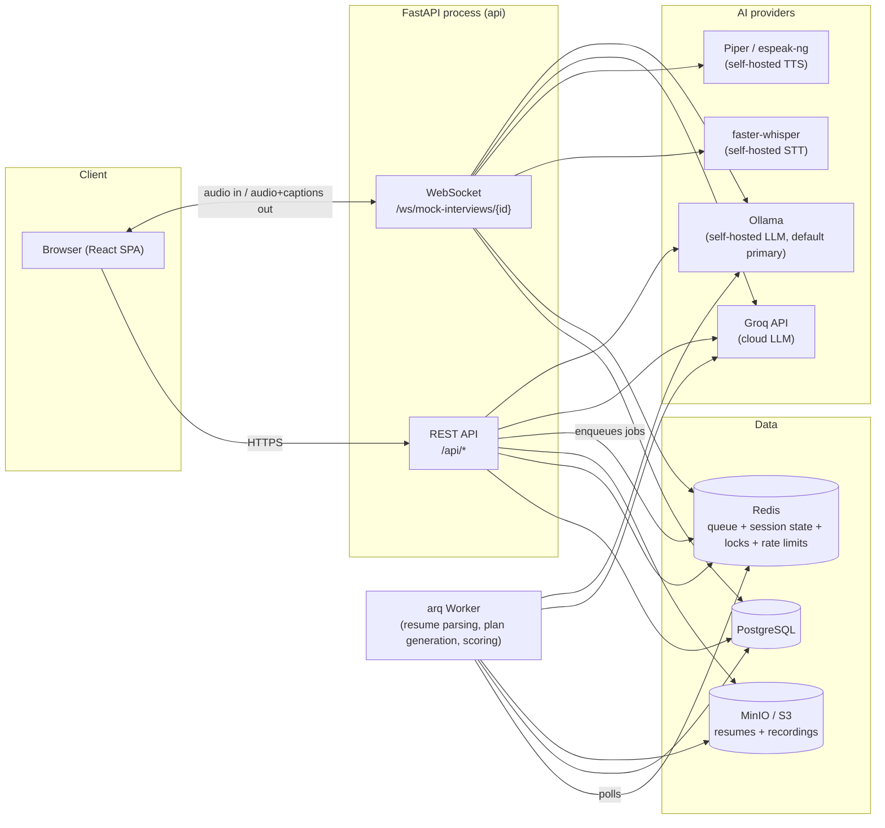
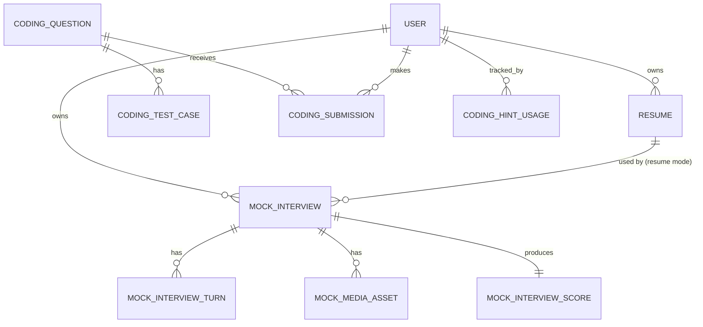
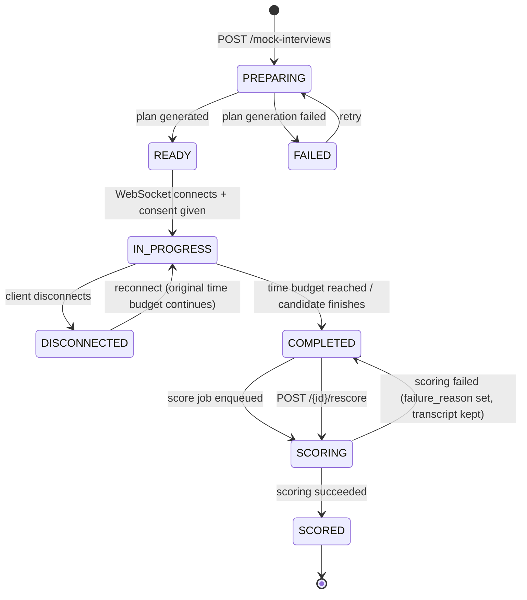
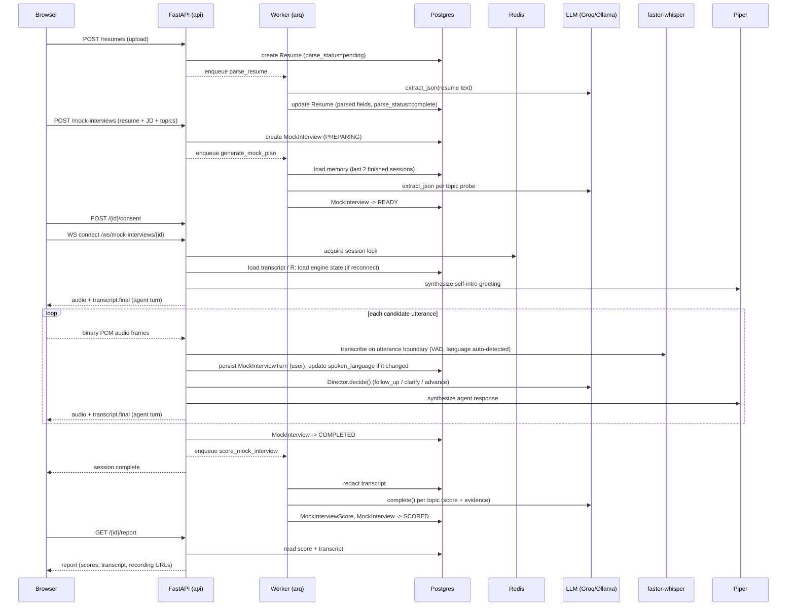
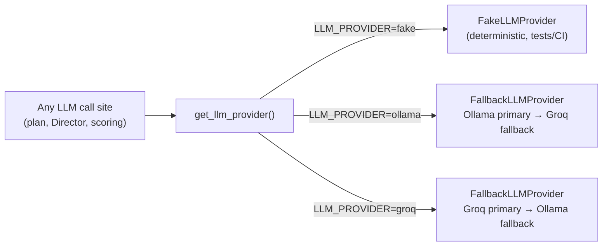

# Architecture

This document describes how the AI Mock Interviews platform is put together: its runtime components, how data flows through a full interview session, the domain model, and the resilience patterns used around every external AI provider.

It reflects the code as it exists today, not a roadmap.

## Table of contents

1. [System overview](#system-overview)
2. [Runtime components](#runtime-components)
3. [Backend structure](#backend-structure)
4. [Frontend structure](#frontend-structure)
5. [Domain model](#domain-model)
6. [Mock interview lifecycle](#mock-interview-lifecycle)
7. [End-to-end interview sequence](#end-to-end-interview-sequence)
8. [LLM provider fallback](#llm-provider-fallback)
9. [Resilience patterns](#resilience-patterns)
10. [Auth model](#auth-model)
11. [Storage](#storage)
12. [Configuration reference](#configuration-reference)

## System overview

The web frontend talks to a single FastAPI process over both REST and WebSocket. That process shares a Postgres database and a Redis instance with a background worker, which runs the slow or unreliable work — resume parsing, interview-plan generation, and scoring — as queued jobs instead of blocking a request. Every AI capability (LLM, speech-to-text, text-to-speech) sits behind a small provider interface, so the app can run entirely on self-hosted, deterministic ("fake") providers in tests and CI, and switch to real cloud/self-hosted providers in development and production without touching business logic.



## Runtime components

All components run as Docker Compose services (`docker-compose.yml`):

| Service | Role | Notes |
|---|---|---|
| `api` | FastAPI app (REST + WebSocket), same process | Port `8005` on the host → `8000` in container; hot-reloads on code change (bind-mounted `./backend`) |
| `worker` | arq background job runner | Same image as `api`, same env, runs `resume_jobs`, `interview_jobs`, `scoring_jobs` |
| `web` | React/Vite dev server | Port `5173`; opt-in with `docker compose --profile frontend up -d --build` |
| `postgres` | Primary datastore | Postgres 16 |
| `redis` | Job queue, interview session-state store, connection locks, rate-limit counters | Redis 7 |
| `minio` | S3-compatible object storage | Resumes and interview recordings; ports `9000` (API) / `9001` (console) |
| `ollama` | Self-hosted LLM, default primary or fallback | `OLLAMA_KEEP_ALIVE=-1` keeps the model resident in memory once loaded — see [LLM provider fallback](#llm-provider-fallback) |
| `ollama-pull` | One-shot init job | Pulls `OLLAMA_MODEL` and runs a throwaway prompt to warm it before real traffic arrives |

`api` and `worker` both depend on Postgres, Redis, and (for `api`) MinIO being healthy before starting. Whisper models and Piper voices are cached in named volumes (`whisper_models`, `piper_voices`) shared between `api` and `worker` so they aren't re-downloaded on every restart.

## Backend structure

```
backend/app/
  api/          FastAPI routers and Pydantic request/response schemas
  core/          settings (Settings/config.py), JWT, dependency injection, structured logging
  db/            SQLAlchemy models, Alembic migrations, seed script
  providers/     LLM / STT / TTS / storage adapters, shared resilience wrapper
  services/      interview engine, director, and scoring logic
  workers/        arq job definitions and worker settings
  ws/              WebSocket handler for the live interview session
```

### API routers

All routers are mounted under `/api`, except the WebSocket handler, which is mounted bare on the same app/port.

| Router | Base path | Endpoints |
|---|---|---|
| `auth.py` | `/api/auth` | `POST /register`, `POST /login`, `POST /refresh`, `POST /logout`, `GET /me` |
| `resumes.py` | `/api/resumes` | `POST ""` (upload), `GET ""` (list), `GET /{id}` |
| `practice.py` | `/api/mock-interviews` | `POST ""`, `GET ""`, `GET /{id}`, `POST /{id}/retry`, `POST /{id}/consent`, `POST /{id}/rescore`, `GET /{id}/report`, `POST /{id}/media` (presigned upload), `POST /{id}/media/complete` |
| `gdpr.py` | `/api/me` | `GET /data-export`, `POST /erase` |
| `provider_tests.py` | `/api/provider-tests` | `POST /groq` (development-only, verifies live Groq connectivity) |
| `ws/interview.py` | `/ws/mock-interviews/{id}` | WebSocket: the live interview session |

The app also exposes `GET /health` (liveness) and `GET /ready` (readiness — pings Postgres, Redis, and every configured provider's `.health()`).

### Providers

Every external capability is behind a small `Protocol` interface, selected at startup via an env var, so business logic never imports a concrete provider:

| Capability | Interface | Providers | Selected by |
|---|---|---|---|
| LLM | `LLMProvider` (`extract_json`, `complete`, `stream_complete`, `health`) | `fake`, `ollama` (self-hosted), `groq` (cloud, wrapped in `FallbackLLMProvider` with Ollama as fallback) | `LLM_PROVIDER` |
| Speech-to-text | — | `fake`, `faster_whisper` | `STT_PROVIDER` |
| Text-to-speech | — | `fake`, `piper` (espeak-ng fallback for Urdu, which has no Piper voice) | `TTS_PROVIDER` |
| Object storage | — | `fake`, `s3` (MinIO or real S3) | `STORAGE_PROVIDER` |

Every provider adapter that makes a network call wraps it in the shared `call_with_resilience()` helper (timeout + jittered retry) and a per-instance `CircuitBreaker` — see [Resilience patterns](#resilience-patterns).

### Services

- **`interview/plan.py`** — generates the interview plan: one probe per topic, built from the resume + job description (or, in language-practice mode, per fixed focus area) via one LLM call each. Falls back to a template question per topic if the LLM call fails or returns unusable JSON, and records that a fallback was used so it's visible rather than silently swallowed.
- **`interview/director.py`** — decides, after each candidate answer, whether to ask a follow-up, ask for clarification, or advance to the next topic. Hard constraints (max 2 follow-ups per topic, remaining time budget) are checked in code *before* ever calling the LLM; the LLM is only consulted within those bounds, and a deterministic fallback (one follow-up, then advance) covers LLM failure.
- **`interview/engine.py`** — a pure, in-memory turn-taking state machine (`InterviewEngine`) that owns topic progression, elapsed time, and turn sequencing. Time-based closing checks (90%/80% of the session duration) always win over the Director's judgment.
- **`interview/memory.py`** — condenses a candidate's last two finished sessions into a short text block prepended to planning/judging prompts, so returning candidates get informed follow-ups instead of a blank slate.
- **`interview/locale.py`** — per-spoken-language (English/Hindi/Urdu) copy: greetings, self-intro prompts, closing lines, fallback questions.
- **`interview/state_store.py`** — persists `EngineState` to Redis so a session survives server restarts and client reconnects.
- **`interview/vad.py`** — silence-duration voice activity detection on raw PCM audio, used to decide when a candidate has finished speaking.
- **`scoring/scorer.py`** — one LLM call per topic, scored 1–5, with the model's cited evidence checked against the actual (PII-redacted) transcript. Raises rather than fabricates a score when there's nothing to score (e.g. no spoken answers).
- **`scoring/redaction.py`** / **`scoring/evidence.py`** — strip PII before anything reaches the LLM or storage, and verify a cited quote genuinely appears in the transcript.

### Background jobs (arq)

| Job | Trigger | Does |
|---|---|---|
| `parse_resume` | Resume upload | Extracts text (PDF/DOCX) from the stored file, calls the LLM to extract structured fields (skills, experience, education — never inferred/invented), sets parse status |
| `generate_mock_plan` | Interview creation | Locks the interview row, loads cross-session memory, generates the topic plan, transitions `PREPARING → READY` (or `FAILED` with a visible reason) |
| `score_mock_interview` | Interview completion / manual `/rescore` | Locks the interview row, redacts PII, scores each topic against the transcript, transitions `SCORING → SCORED` (or leaves it `COMPLETED` with a `failure_reason`, transcript intact, retryable) |

## Frontend structure

React 18 + Vite + TypeScript, styled with Tailwind, server state managed with React Query, routing via React Router v7, no separate global-state library.

```
frontend/src/
  features/
    auth/        login, registration
    interview/    live session UI: InterviewRoomPage, wsClient.ts (WebSocket protocol client),
                   audio.ts (mic capture + PCM encoding), preflight, completion
    practice/    interview creation forms (resume/JD and language-practice), history, report view
  lib/
    api.ts        fetch wrapper (cookie auth, auto-refresh on 401) + hand-rolled SSE-over-POST client
    auth.tsx       auth context (GET /api/auth/me on mount)
    types.ts       shared TypeScript types mirroring backend schemas
  components/ui/  Button, Card, Alert, Field, PageShell, StatusPill, Spinner — shared primitives
```

`InterviewSocket` (`wsClient.ts`) manages the interview WebSocket: exponential-backoff reconnect (capped at 30s) except on terminal close codes (`1000` normal close, `1008` policy/auth failure, `4001` no consent given, `4009` a duplicate connection is already active for this session). The client opens with `session.start` (sample rate) and can send `session.end`; the server sends `transcript.final`, `agent.speaking_start` / `agent.speaking_end`, `timer.tick`, `session.complete`, and `error`.

## Domain model



Every personal resource — resumes, interviews, turns, scores, and media — is scoped to exactly one `User`. There are no organizations, roles, or shared/team resources anywhere in the schema. Ownership checks return `404` (not `403`) for another user's resource, so a request never confirms that resource even exists.

Key tables:

- **`users`** — email (unique), Argon2 password hash, full name, last login.
- **`resumes`** — storage key, filename, MIME type, extracted raw text, parsed structured fields (JSON), parse status.
- **`mock_interviews`** — either resume + job-description + topics, *or* spoken language + level (enforced by both a Pydantic validator and a database `CHECK` constraint — never both, never neither); duration constrained to 15 or 30 minutes; spoken language (`en`/`hi`/`ur`); state (see [lifecycle](#mock-interview-lifecycle) below).
- **`mock_interview_turns`** — one row per turn, speaker (`agent`/`user`), text, timestamp — the transcript.
- **`mock_media_assets`** — audio/video recording chunks, storage key, a `ready` flag set once upload is confirmed.
- **`mock_interview_scores`** — overall score, readiness tier, per-dimension scores, strengths/weaknesses/improvements, the model used, and a `failure_reason` if scoring failed.

Historical coding-related Alembic revisions remain for migration continuity, but
those tables are not used by the active application.

## Mock interview lifecycle



A disconnected session resumes against its *original* elapsed-time budget — time isn't paused by a disconnect. A failed scoring run never produces a fabricated score; it leaves the interview `COMPLETED` with a `failure_reason` and a fully intact transcript, retryable via `POST /{id}/rescore`.

## End-to-end interview sequence



## LLM provider fallback

Every LLM call in the app — plan generation, Director judgments, resume extraction, and scoring — goes through one factory, `get_llm_provider()`, so fallback behavior is identical everywhere rather than re-implemented per call site.



- **`FallbackLLMProvider.complete` / `.extract_json`** — try the configured primary; on an exception (rate limit, timeout, malformed response), try the fallback. `LLM_PROVIDER=ollama` is the example configuration default; Groq requires a valid API key.
- **`FallbackLLMProvider.stream_complete`** — only switches providers if the primary fails *before* yielding a single chunk. A partially-streamed response can't be un-sent to a client already forwarding it over SSE, so a mid-stream failure propagates instead of silently switching providers.
- Both providers share the app-wide `CircuitBreaker`/`call_with_resilience` wrapper (see below).

**Operational note — Ollama on a CPU-only host:** the `ollama` service sets `OLLAMA_KEEP_ALIVE=-1` and the `ollama-pull` init job pre-warms the model, because an idle Ollama model unloads after 5 minutes by default and reloading it from disk on a CPU-only host takes on the order of 90 seconds — far past any reasonable per-request timeout. `OllamaLLMProvider.complete()` also sends `keep_alive: -1` on every request as defense-in-depth. Separately, `extract_json()` (used for plan generation and resume extraction, which involve much larger prompts) uses a longer, single-attempt timeout (120s, no retries) rather than the short-prompt default (20s, up to 3 attempts) — CPU-bound prompt evaluation on a large prompt can legitimately take longer than 20s even with a warm model, and retrying a sustained-slowness failure just discards the previous attempt's partial KV-cache progress without fixing anything.

## Resilience patterns

`providers/resilience.py` provides two primitives shared by every provider adapter that makes a network call (LLM, STT, TTS):

- **`call_with_resilience()`** — wraps a call in `asyncio.wait_for(timeout_s)`, retrying up to `max_retries` times with jittered exponential backoff on any exception.
- **`CircuitBreaker`** — per-provider-instance; opens after 3 consecutive failures and refuses calls for 30 seconds, then allows one half-open trial call to decide whether to close again. This stops a already-down provider from being hammered with retries on every subsequent request.

The faster-whisper STT provider deliberately uses `cpu_threads=1` and zero retries: a timed-out CPU-bound transcription thread can't actually be cancelled, so a slow model doesn't just fail one request — it leaves a stuck thread competing with every future call. Keeping the thread pool to one and never retrying bounds the damage to a single request.

## Auth model

JWT access + refresh tokens in HttpOnly cookies (`samesite=strict`, `secure` outside development), signed with `HS256`. Access tokens live 15 minutes, refresh tokens 7 days; both carry the user ID, token type, issued-at, expiry, and a JWT ID. Passwords are hashed with Argon2. `apiRequest()` on the frontend automatically retries a request once after a silent token refresh on `401`.

There are no roles or organizations — authorization is simply "does this resource belong to the requesting user," enforced by an `owned()` dependency on every resource route. A mismatch returns `404`, not `403`, so a request never reveals that another user's resource exists at all.

Login and registration are rate-limited per IP via Redis (register: 5/hour, login: 10/5 minutes).

## Storage

`S3StorageProvider` talks to MinIO in development and any real S3-compatible service in production, using two separate clients: one against the internal endpoint (backend-to-storage I/O) and one purely for signing presigned URLs against a browser-reachable endpoint — the browser cannot resolve the internal Docker hostname the backend uses.

Stored objects:
- **Resumes** — `resumes/{user_id}/{uuid}.{pdf|docx}`
- **Interview recordings** — `mock-interviews/{interview_id}/{kind}/chunk-{index:05d}.webm`, uploaded directly from the browser via a presigned PUT URL and confirmed via `POST /{id}/media/complete` — only confirmed chunks appear in a report.

## Configuration reference

Full list of environment variables lives in `.env.example`. The most consequential ones:

| Variable | Purpose |
|---|---|
| `LLM_PROVIDER` | `fake` / `ollama` / `groq` — see [LLM provider fallback](#llm-provider-fallback) |
| `GROQ_API_KEY`, `GROQ_MODEL` | Cloud LLM credentials/model (no default key — the app refuses to silently run against a real API with an empty credential) |
| `OLLAMA_URL`, `OLLAMA_MODEL` | Self-hosted LLM endpoint/model |
| `STT_PROVIDER`, `STT_ENGINE`, `STT_MODEL_SIZE`, `WHISPER_MODEL_SIZE` | Speech provider, engine (`faster_whisper` or `whisper_cpp`), and model selection; `.env.example` uses `WHISPER_MODEL_SIZE=small` |
| `TTS_PROVIDER`, `PIPER_VOICE`, `PIPER_VOICE_HI` | Text-to-speech provider and per-language voices (Urdu has no Piper voice and falls back to espeak-ng) |
| `STORAGE_PROVIDER`, `S3_*` | Object storage endpoint/credentials/bucket |
| `JWT_SECRET`, `ACCESS_TOKEN_TTL_MINUTES`, `REFRESH_TOKEN_TTL_DAYS` | Auth token signing and lifetimes |
| `DATABASE_URL`, `REDIS_URL` | Core datastore connections |
